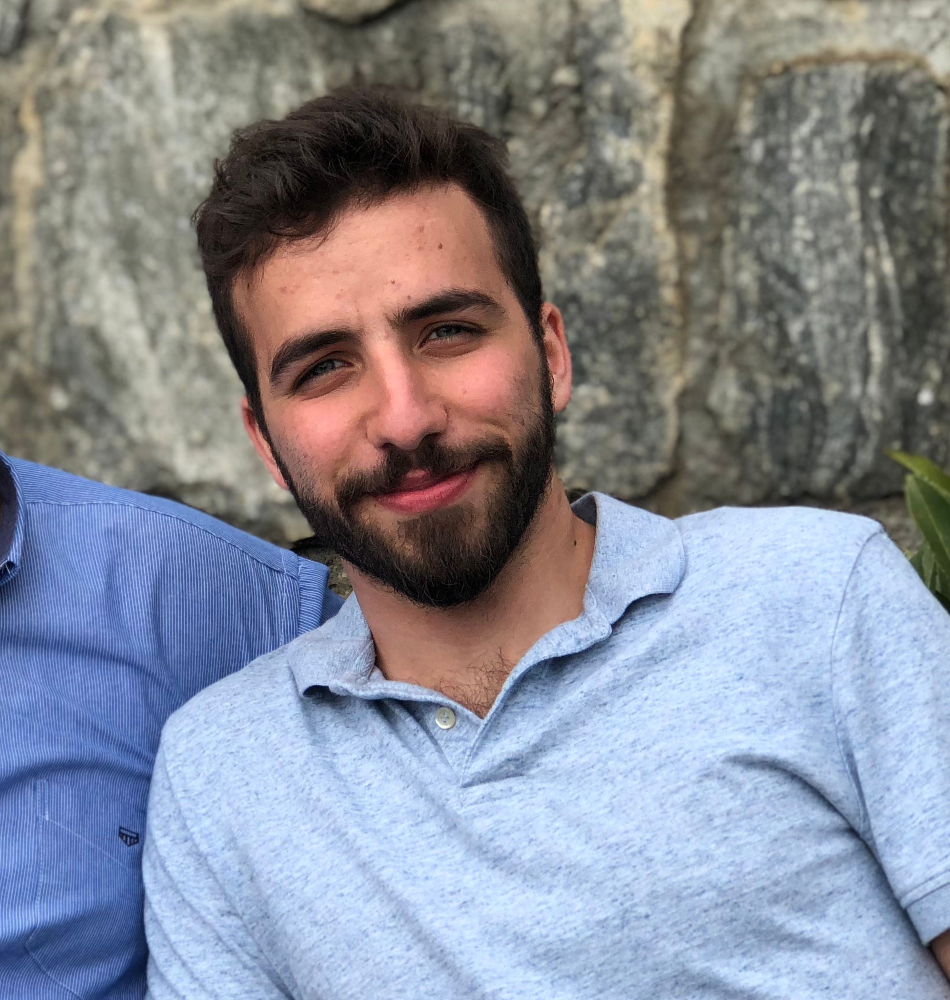
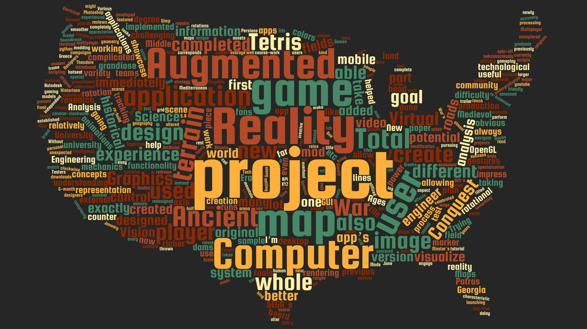

Hi there!

   
My name is Theo and I am a Software Engineer working in Augmented Reality, Computer Vision and Graphics.   

If you are interested in my work, you can read about my projects <a href="{{ site.baseurl }}tag/work/">here</a>, watch some demos <a href="https://youtube.com/user/{{site.youtube}}">here</a>, or download the source code <a href="https://github.com/{{site.github}}">here</a>. If you want to learn more about me and my journey keep reading!  

I grew up in Athens, Greece. My mother is from New York and my father from Istiaia, Greece.  

I received my Electrical & Computer Engineering degree (5yr) from the <a href="http://www.ece.upatras.gr/en/">University of Patras</a>, in 2016. During my time in UPatras, I researched the field of Augmented Reality under the supervision of the brilliant <a href="https://scholar.google.gr/citations?hl=en&user=E361geAAAAAJ&view_op=list_works&sortby=pubdate">Konstantinos Moustakas</a>. Together, we worked on a project called <a href="{{ site.baseurl }}ar-3d-maps">'Augmented Reality 3D Maps'</a> which led to a <a href="{{ site.baseurl }}contours-paper">publication</a> soon after graduation.  

During the summers of 2015 and 2016 I interned as a Software Engineer with <a href="http://www.mantis.group/">Mantis Informatics S.A.</a>, where I developed Head Mounted Display (HMD) applications for warehouse environments. I worked with various devices (Vuzix M100, Moverio BT-200, etc) and attempted to reduce the time spent in the most expensive process of warehousing: Order Picking.  

After graduation, I embarked on my 9 month mandatory military service in the Greek Army (NATO forces); first as a tank commander on the border and finally as an engineer in Athens HQ.

Upon completion of my service (Aug. 2017), I moved to the US to pursue my MS CS degree in <a href="http://www.gatech.edu/">Georgia Tech</a>, where I specialize in Computer Graphics & Vision.   

During school time, I work with <a href="https://www.cc.gatech.edu/home/thad/">Dr. Thad Starner</a>, inventor of Google Glass and HMD expert, as a Head Teaching Assistant for the Artificial Intelligence graduate course. As Head TA I lead a team of 13 GTAs, managing 450 online graduate students and 140 on-campus. I am responsible for substitute teaching, course content, midterm and final exams etc.  

Under his supervision, I research the field of Head Mounted Displays and Wearables, working on various different projects and publications (<a href="{{ site.baseurl }}hud-rfid">latest paper on ISWC '2018</a>).  

During the summer I interned with Amway as a Software Engineer, working on mobile Augmented Reality. I worked in the R&D department, developing interactive AR applications for Amway's own product lines. My <a href="{{ site.baseurl }}amway">app prototypes</a> were received well and were ultimately incorporated into production.   

Let's <a href="https://linkedin.com/in/{{site.linkedin}}">connect</a>!
  

  

